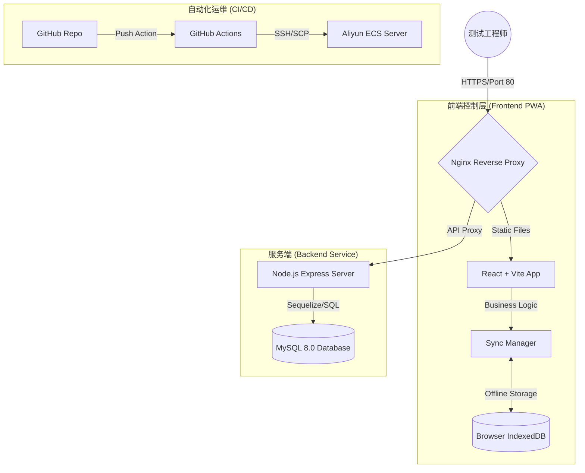

# 📑 Vehicle Test Recorder 架构设计文档

## 1. 系统概述
Vehicle Test Recorder 是一款面向车辆外场测试的数字化记录工具。其核心目标是解决在弱网或无网环境下（如地下车库、隧道、偏远山区）高效、可靠地记录测试数据，并实现数据的自动同步与集中管理。

---

## 2. 总体架构图 (Architecture Overview)

---

## 3. 核心分层设计

### 3.1 前端层 (Frontend Layer) - 离线优先策略
*   **技术栈**: React 18, Vite, TailwindCSS (Vanilla CSS theme), Lucide Icons.
*   **同步引擎 (SyncManager)**: 
    - 采用 **Offline-First** 逻辑。所有数据保存操作优先进入本地 `IndexedDB` 队列。
    - **SyncStatusPill**: 实时监听页面在线状态（`online`/`offline`）及后端连通性。
    - **自动重试机制**: 当网络恢复或后端恢复响应时，系统会自动以队列方式异步补全数据推送。
*   **状态管理**: 使用 React Hooks (useState/useEffect) 管理复杂测试流程。

### 3.2 服务层 (Service Layer)
*   **技术栈**: Node.js, Express.
*   **核心功能**: 
    - **RESTful API**: 提供 `/api/test-sessions` (POST/PUT), `/api/bugs` 等标准化接口。
    - **缓存控制 (Cache-Busting)**: 针对 GET 请求实施防缓存机制，避免前端展示脏数据或已删除的数据。
    - **幂等性处理**: 支持通过 ID 更新会话，防止同步冲突。
    - **静态托管**: 由 Nginx 接管生产环境的静态资源分发。

### 3.3 数据层 (Data Layer)
*   **技术栈**: MySQL 8.0.
*   **核心表结构**:
    - `test_sessions`: 存储车辆元数据（VIN, Model Year, Tester, Production Stage, Test Environment 等）。引入 `is_deleted` 字段实现逻辑删除。
    - `test_results`: 存储具体的测试条目、判断结果（Pass/Fail）、响应耗时（Timing）及测试证据附件（`media`）。
    - `cases`: 存储预置的 800+ 测试用例库。
    - `bugs`: 存储测试过程中发现的缺陷（支持生成标准如 BUG-0001 格式的 ID）及媒体附件（`media`），随主会话的逻辑删除机制同步在各端隐藏，确保数据安全可找回。

---

## 4. 部署架构 (Infrastructure)

*   **入口控制**: Nginx 监听 80 端口，通过 `location` 块实现前后端分离。
    - `/` -> 指向 `/var/www/vehicle-test-recorder/dist` (静态文件)。
    - `/api` -> 代理至 `localhost:3001` (Node.js 进程)。
*   **进程守护**: 使用 **PM2** 管理 Node.js 环境，确保后端服务自动重启。
*   **自动化流水线**: 
    - 配置 GitHub Actions 实现自动部署，自动处理静态资源权限迁移 (`/var/www/`)。
    - 引入 `workflow_dispatch` 机制，支持通过 GitHub UI 手动触发并监控到生产服务器（阿里云 ECS）的部署任务。

---

## 5. 关键业务流

1. **测试开始**: 用户输入车辆及环境信息，SyncManager 初始化本地 Session。
2. **离线保存**: 用户点击“Save”并上传测试截图，数据与多媒体（Media）信息写入 IndexedDB，UI 显示“Syncing Assets”胶囊。
3. **静默同步**: 浏览器检测到网络通畅，SyncManager 逐条执行 API 调用，成功后清理本地队列。
4. **缺陷追踪**: 测试中提报的 Bug 统一分配专业工单号（如 BUG-0001），包含截图举证，并随对应会话保持生命周期一致（通过逻辑删除同步隐藏）。
5. **数据闭环与导出**: 后端接收数据持久化至 MySQL，提供跨平台兼容的高保真测试报告导出（包含特定的“手机APP-iOS/Android”等定制化版式）。
