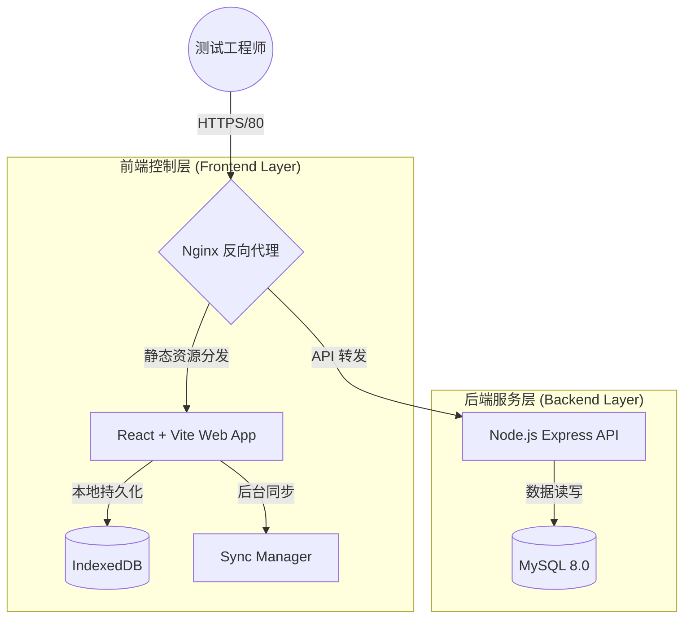

# System Design Document (SDD) 
# 系统设计文档 
## Vehicle Test Recorder (车辆测试记录系统)

**当前版本 (Current Version)**: V1.0  
**创建日期 (Date Created)**: 2026-05-21  

---

## 目录

1. [文档简介 (Document Overview)](#1-文档简介-document-overview)
2. [系统概况 (System Overview)](#2-系统概况-system-overview)
3. [软件设计 (Software Design)](#3-软件设计-software-design)
4. [数据设计 (Data Design)](#4-数据设计-data-design)
5. [系统平台安全设计 (Security Design)](#5-系统平台安全设计-security-design)
6. [操作与运维设计 (Operations Design)](#6-操作与运维设计-operations-design)
7. [结论 (Conclusion)](#7-结论-conclusion)

---

## 1. 文档简介 (Document Overview)

### 1.1 范围 (Scope)
本文档旨在详细描述 **Vehicle Test Recorder (车辆测试记录系统)** 的系统架构、组件设计、数据流向及安全运维规范。本系统专为解决车辆外场测试中（如地下车库、隧道等无网/弱网环境）的数据记录与同步问题而设计，支持多端自适应响应，并具备离线优先（Offline-First）能力。

### 1.2 读者 (Audience)
| 角色 (Role) | 技能要求 (Skill Required) |
| :--- | :--- |
| 开发人员 (Developer) | React / Node.js / 数据库基础开发技能 |
| 架构师 (Architect) | 系统架构与离线缓存设计经验 |
| 测试人员 (Tester) | 软件测试流程与车辆测试业务知识 |
| 项目经理 (PM) | 项目管理及进度把控能力 |
| 运维管理员 (IT Admin) | Linux (Ubuntu/CentOS), Nginx, PM2, MySQL 管理能力 |

### 1.3 定义和缩写词 (Definitions and Acronyms)
| 术语 (Term) | 描述 (Description) |
| :--- | :--- |
| PWA | Progressive Web App，渐进式 Web 应用，支持离线缓存和沉浸式体验。 |
| IndexedDB | 浏览器内置的底层 API，用于客户端大容量结构化数据存储。 |
| SyncManager | 本系统自定义的核心同步引擎，负责离线数据排队及在线状态下的静默上传。 |
| CI/CD | 持续集成与持续部署 (Continuous Integration/Continuous Deployment)。 |

---

## 2. 系统概况 (System Overview)

### 2.1 描述 (Description)
Vehicle Test Recorder 是一个前后端分离的现代化 Web 应用。前端作为交互入口，负责在网络波动环境下的稳定数据采集；后端作为数据中枢，处理业务逻辑并将数据持久化，最终生成标准化的测试报表供导出分析。

### 2.2 系统架构 (System Architecture)
系统采用典型的三层架构（前端展现层、后端服务层、数据存储层），并融合了 PWA 离线缓存策略。

---

## 3. 软件设计 (Software Design)

### 3.1 组件 (Components)

#### 3.1.1 离线同步引擎 (SyncManager)
- **描述**: 系统的核心大脑，监听浏览器的 `online` 和 `offline` 事件。在无网环境下，拦截数据保存请求并将其写入 IndexedDB 列队；在网络恢复后，以先进先出 (FIFO) 的策略自动将本地数据静默推送到后端 API，并处理上传失败重试及幂等性。

#### 3.1.2 缺陷追踪模块 (Defect Tracker)
- **描述**: 支持在测试过程中随时提报 Bug，自动生成 `BUG-XXXX` 格式的标准化工单号。支持多媒体证据（图片等）的本地缓存及服务端存储上传。系统对会话和缺陷实行**逻辑删除**机制，通过底层关联确保已删除数据在所有看板中隔离隐藏。

#### 3.1.3 报表导出引擎 (Export Engine)
- **描述**: 后端模块，使用 `xlsx` 等库将数据库内的测试结果及缺陷数据转化为 Excel 报表，支持定制化版式（如“手机APP-iOS”及“手机APP-Android”专项报表排版）。

### 3.2 接口 (Interfaces)

| 接口名称 (Interface Name) | 方法 | 描述 |
| :--- | :--- | :--- |
| `/api/test-sessions` | POST/PUT | 创建或更新测试会话（支持幂等操作） |
| `/api/test-sessions/:id` | GET | 获取具体测试会话及对应测试用例结果（支持防缓存机制 Cache-Busting）|
| `/api/bugs` | POST/GET | 提交缺陷及多媒体附件 / 查询历史缺陷 |
| `/api/export` | GET | 请求并下载对应的定制化 Excel 测试报告 |

---

## 4. 数据设计 (Data Design)

### 4.1 物理数据模型 (Physical Data Model)
本系统采用 **MySQL 8.0** 关系型数据库，核心表包含：
1. **`test_sessions`**: 存储车辆及环境元数据（VIN码，测试环境，量产阶段，测试人员等）。
2. **`test_results`**: 测试执行明细，记录每一项用例的 Pass/Fail 状态、具体响应耗时以及测试证据（media）。
3. **`cases`**: 全局预置测试用例库（约800+条，根据不同模块分类）。
4. **`bugs`**: 缺陷清单，包含所属 Session ID 关联、问题描述、状态、标准化工单号及对应媒体截图。

### 4.2 数据完整性设计 (Data Integrity)
- **逻辑删除**: 系统在 `test_sessions` 表引入了 `is_deleted` 标记位进行逻辑删除。当某次测试会话被删除时，系统保留底层的所有子表数据（如 `test_results` 以及 `bugs`），但在所有的业务 API 层通过 JOIN 查询进行防泄漏隔离。
- **媒体文件关联**: 附件及媒体文件的路径随实体数据一起持久化，并支持断网环境的序列化暂存。

---

## 5. 系统平台安全设计 (Security Design)

### 5.1 数据请求安全
- **输入校验**: 前端和后端均对输入的项目代号、VIN 码等关键字段采用正则匹配清洗，防止 XSS 或 SQL 注入攻击。
- **防止数据脏读**: 所有的 GET 业务数据接口请求中注入防缓存机制（Cache-Busting / 时间戳后缀），防止在返回列表或查阅详情时命中浏览器或代理的过时缓存。

### 5.2 网络与部署安全
- Nginx 统一代理 80 (或 443 端口)，Node.js 后端进程不对外直接暴露端口，只允许通过本地 loopback 被反向代理。

---

## 6. 操作与运维设计 (Operations Design)

### 6.1 基础设施架构 (Infrastructure)
- **服务器 (Server)**: 阿里云 ECS，IP `47.103.7.184`。
- **进程守护**: 借助 **PM2** 管理 Node.js 环境，在发生意外崩溃时能够自动重启服务，保证 99.9% 运行时间。

### 6.2 自动化部署流 (CI/CD)
系统深度集成 **GitHub Actions** 作为流水线：
- **触发机制**: 支持代码 `Push` 自动触发构建，同时也开放了 `workflow_dispatch`，允许开发及运维团队在 GitHub 界面手动触发生产环境的一键部署。
- **资源迁移**: 部署脚本自动处理 React 编译后产物至 `/var/www/vehicle-test-recorder/dist` 的迁移，并自动重置 `www-data` 及执行权限，重启 Nginx 及 PM2 进程。

---

## 7. 结论 (Conclusion)
Vehicle Test Recorder 通过前后端分离、引入本地化数据库和自动化同步队列技术，完美解决了传统网页应用无法在无网外场有效作业的痛点。架构上具备高可维护性和敏捷部署能力，完全满足当前的测试场景需求。
